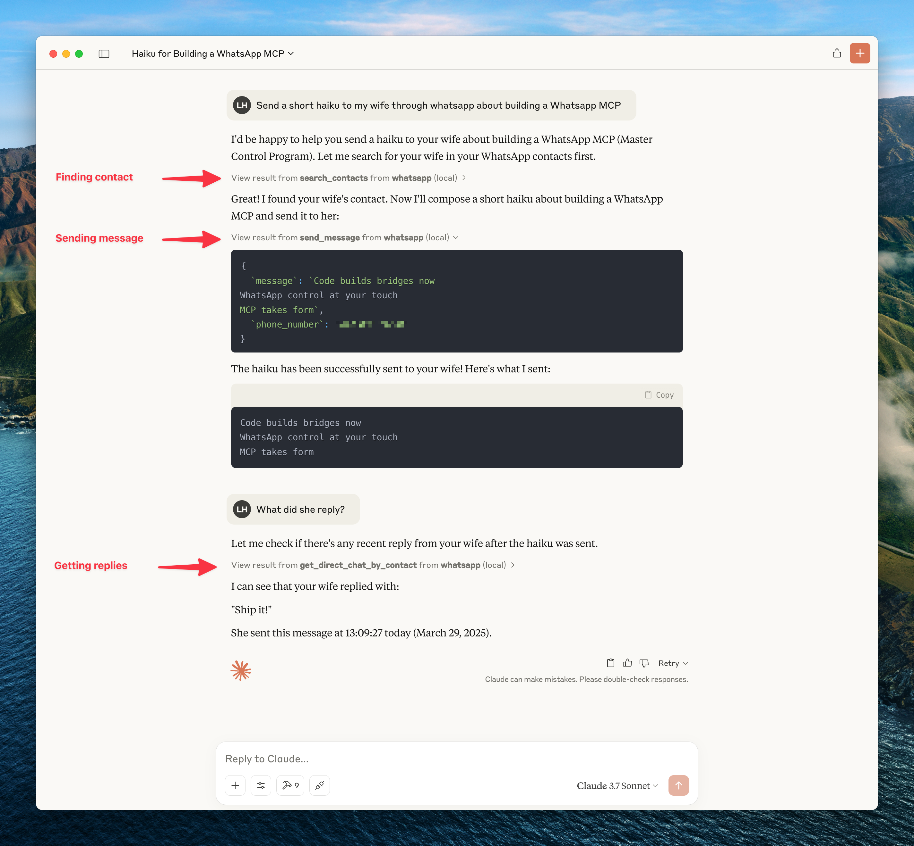
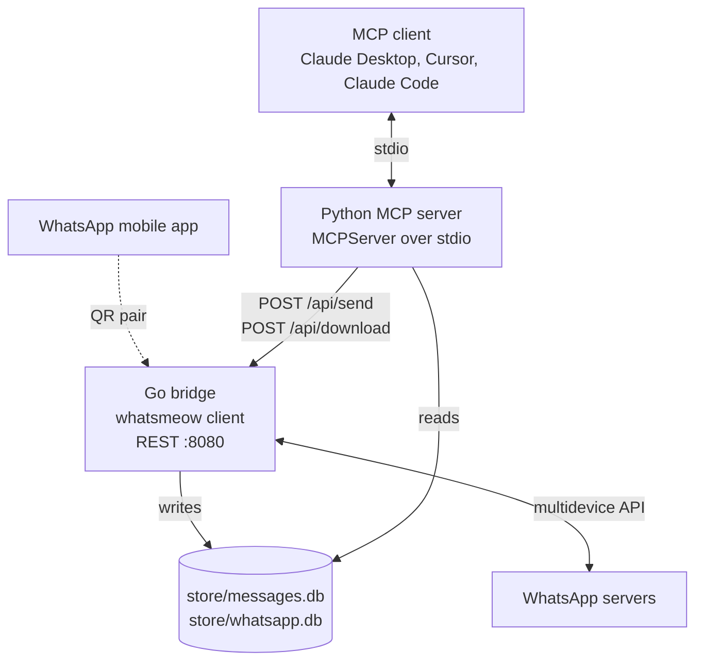

# whatsapp-mcp

Model Context Protocol (MCP) server that connects Claude (or any MCP client) to a personal WhatsApp account, via a local Go bridge that talks to the WhatsApp multidevice API and a Python MCP server that exposes reads and writes as tools.

[](https://github.com/weirdapps/whatsapp-mcp/actions/workflows/ci.yml)
[](LICENSE)

This is a maintained fork of [lharries/whatsapp-mcp](https://github.com/lharries/whatsapp-mcp). Upstream code and MIT license are preserved; the fork adds a compatibility fix for the current `whatsmeow` API, the port to the `mcp` v2 SDK, a pytest suite, a launcher script, CI (GitHub Actions), Dependabot (github-actions + gomod + uv), SonarCloud config, Ruff config, and a `SECURITY.md`.

> **Personal account, no server.** The bridge pairs with your phone via WhatsApp Web multidevice. All message history is stored locally in SQLite. Data only reaches an LLM when a tool call reads it. As with any MCP server exposing personal data, prompt injection can lead to exfiltration; see Simon Willison on [the lethal trifecta](https://simonwillison.net/2025/Jun/16/the-lethal-trifecta/).



## Architecture

Two processes on the same machine, sharing a SQLite file on disk.



- **Go bridge** (`whatsapp-bridge/main.go`, ~1350 lines): `whatsmeow` client, SQLite storage for chats and messages, REST server on `localhost:8080` with `/api/send` and `/api/download`. Also stores the whatsmeow session in a separate SQLite file so pairing survives restarts.
- **Python MCP server** (`whatsapp-mcp-server/`): tools registered in `main.py` on an `mcp.server.MCPServer` (the v2 SDK's high-level server, formerly `FastMCP`). Reads (`list_messages`, `list_chats`, contact lookups, ...) query `messages.db` directly via `sqlite3`. Writes (`send_message`, `send_file`, `send_audio_message`, `download_media`) POST to the bridge REST endpoints.

## MCP tools

Registered in [`whatsapp-mcp-server/main.py`](whatsapp-mcp-server/main.py):

| Tool | Purpose |
|---|---|
| `search_contacts` | Search contacts by name or phone number. |
| `list_chats` | List chats with optional query, pagination, and last-message preview. |
| `get_chat` | Chat metadata by JID. Returns `null` when no such chat exists. |
| `get_direct_chat_by_contact` | Resolve a 1:1 chat from a phone number. Returns `null` when there is no match. |
| `get_contact_chats` | All chats involving a given contact JID. |
| `get_last_interaction` | Most recent message with a contact. |
| `list_messages` | Messages with filters (date range, sender, chat, keyword) and optional surrounding context. Returns a formatted transcript string, not a list of objects. |
| `get_message_context` | N messages before and after a target message id. |
| `send_message` | Send text to a 1:1 or group (accepts phone number or JID). |
| `send_file` | Send image, video, document, or raw audio. |
| `send_audio_message` | Send audio as a playable voice note (auto-converts to Opus OGG via `ffmpeg`; requires ffmpeg on PATH). |
| `download_media` | Fetch media referenced by a stored message and return the local file path. |

Group JIDs end in `@g.us`; individual JIDs in `@s.whatsapp.net`.

Tools that return chats, contacts or message context emit plain JSON objects: `whatsapp.py` builds dataclasses internally and `main.py` converts them with `dataclasses.asdict` at the tool boundary, so `datetime` fields arrive as ISO-8601 strings. Returning the dataclasses directly makes the MCP SDK reject the response against the tool's own output schema, which is what used to happen; see [`tests/`](whatsapp-mcp-server/tests/) for the regression coverage.

## Requirements

- Go 1.25+ with CGO enabled (needed by `github.com/mattn/go-sqlite3`).
- Python 3.11+ (pinned via `.python-version`; `pyproject.toml` requires `>=3.11`).
- [`uv`](https://docs.astral.sh/uv/) for the Python server.
- `ffmpeg` (optional): only for sending non-Opus audio as WhatsApp voice messages. Without it, `send_file` still works for any audio file.

Python dependencies (see [`pyproject.toml`](whatsapp-mcp-server/pyproject.toml)): `mcp[cli]>=2.0.0`, `httpx>=0.28.1`, `requests>=2.34.2`. Dev group: `pytest`, `pytest-asyncio`.
Go dependencies (see [`go.mod`](whatsapp-bridge/go.mod)): `go.mau.fi/whatsmeow`, `github.com/mattn/go-sqlite3`, `github.com/mdp/qrterminal`, `google.golang.org/protobuf`.

## Installation

```bash
# HTTPS (no SSH key required):
git clone https://github.com/weirdapps/whatsapp-mcp.git
# or, with SSH:
git clone git@github.com:weirdapps/whatsapp-mcp.git
cd whatsapp-mcp
```

### 1. Build and run the Go bridge

```bash
cd whatsapp-bridge
go build -o whatsapp-bridge .
./whatsapp-bridge
```

Or, from source, `go run main.go`. From the repo root, `./start-bridge.sh` execs the pre-built binary in `whatsapp-bridge/`.

On first launch the terminal prints a QR code. Scan it in WhatsApp on your phone under **Settings > Linked Devices > Link a Device**. Session state is written to `whatsapp-bridge/store/whatsapp.db` and persists across restarts. WhatsApp only forces re-pairing if you unlink the device from the phone, or the phone stays offline long enough that WhatsApp expires the linked session (currently around 30 days).

After pairing, the bridge listens on `http://127.0.0.1:8080`, loopback only, and starts syncing history into `whatsapp-bridge/store/messages.db`. Initial history sync may take a few minutes on chatty accounts.

### Run it in the background (macOS LaunchAgent)

A bridge started in a terminal dies with that terminal. Run it as a LaunchAgent instead, from `launchd/whatsapp-bridge.plist.template`. The agent keeps it alive and restarts it after a crash or a reboot. Pair once in a terminal first, because a background job cannot show you a QR code.

```bash
install -m 600 /dev/null ~/Library/Logs/whatsapp-bridge.err
chmod -R go-rwx whatsapp-bridge/store
sed -e "s#__REPO_DIR__#$(pwd)#g" -e "s#__HOME__#$HOME#g" launchd/whatsapp-bridge.plist.template \
  > ~/Library/LaunchAgents/local.whatsapp-mcp.bridge.plist
launchctl bootstrap gui/$(id -u) ~/Library/LaunchAgents/local.whatsapp-mcp.bridge.plist
```

The agent discards stdout, because the bridge prints the sender and text of every message it stores. Only crashes reach `~/Library/Logs/whatsapp-bridge.err`. Its umask makes everything the bridge creates owner-only.

To re-pair, stop the agent, pair in a terminal, then start the agent again:

```bash
launchctl bootout gui/$(id -u)/local.whatsapp-mcp.bridge
./start-bridge.sh    # scan the QR code, wait for "Connected", then Ctrl+C
launchctl bootstrap gui/$(id -u) ~/Library/LaunchAgents/local.whatsapp-mcp.bridge.plist
```

Clear the terminal afterwards, because its scrollback holds the messages the history sync printed.

### 2. Install and run the Python MCP server

```bash
cd whatsapp-mcp-server
uv sync
```

The server is launched via stdio by the MCP client (see below). To run it manually for a smoke test:

```bash
uv run main.py
```

### 3. Register the server with your MCP client

Replace `{{PATH_TO_UV}}` with the output of `which uv` and `{{REPO_ROOT}}` with the absolute path where you cloned this repo.

```json
{
  "mcpServers": {
    "whatsapp": {
      "command": "{{PATH_TO_UV}}",
      "args": [
        "--directory",
        "{{REPO_ROOT}}/whatsapp-mcp/whatsapp-mcp-server",
        "run",
        "main.py"
      ]
    }
  }
}
```

- **Claude Desktop**: `~/Library/Application Support/Claude/claude_desktop_config.json` (macOS).
- **Cursor**: `~/.cursor/mcp.json`.
- **Claude Code**: `claude mcp add whatsapp -- {{PATH_TO_UV}} --directory {{REPO_ROOT}}/whatsapp-mcp/whatsapp-mcp-server run main.py`.

Restart the client; `whatsapp` should appear in the available tools list.

### Windows note

`go-sqlite3` needs CGO. Install a C toolchain (MSYS2 with `ucrt64`), then:

```bash
cd whatsapp-bridge
go env -w CGO_ENABLED=1
go run main.go
```

Without this you will see: `Binary was compiled with 'CGO_ENABLED=0', go-sqlite3 requires cgo to work.`

## Configuration

The paths and port are compiled in. One optional environment variable for the bridge, `WHATSAPP_SEND_ALLOWED_DIRS`, replaces the folders `/api/send` may attach files from.

| Setting | Value | Where |
|---|---|---|
| Bridge REST port | `8080` | `whatsapp-bridge/main.go` (`startRESTServer(client, messageStore, 8080)`) |
| Bridge REST bind | `127.0.0.1` (loopback only) | `whatsapp-bridge/main.go` (`serverAddr`) |
| Bridge API token | `whatsapp-bridge/store/api_token` (0600, created on first start; sent as `X-Bridge-Token`) | `whatsapp-bridge/security.go`, `whatsapp-mcp-server/whatsapp.py` (`BRIDGE_TOKEN_PATH`) |
| Folders `/api/send` may attach from | `~/Downloads` and the temp directories; override with `WHATSAPP_SEND_ALLOWED_DIRS` (colon-separated) | `whatsapp-bridge/security.go` (`sendRoots`) |
| Bridge REST base URL | `http://localhost:8080/api` | `whatsapp-mcp-server/whatsapp.py` (`WHATSAPP_API_BASE_URL`) |
| Messages DB (Python reads, Go writes) | `whatsapp-bridge/store/messages.db` | `whatsapp-mcp-server/whatsapp.py` (`MESSAGES_DB_PATH`) |
| Session DB (whatsmeow) | `whatsapp-bridge/store/whatsapp.db` | `whatsapp-bridge/main.go` |

Because `MESSAGES_DB_PATH` is computed as `..` relative to the Python server directory, both components must live in the same working copy on the same host.

## Media handling

- **Incoming media** are stored as metadata only in `messages.db`. To retrieve bytes, call `download_media(message_id, chat_jid)`; the bridge fetches from WhatsApp, saves to disk, and returns the path.
- **Outgoing files** via `send_file` handle image, video, document, and raw audio.
- **Voice notes** via `send_audio_message` require `.ogg` Opus. If the input is not already Opus, `whatsapp-mcp-server/audio.py` shells out to `ffmpeg` with voice-optimised settings (32 kbps VBR, 24 kHz, 60 ms frames, `-application voip`). Without `ffmpeg` on PATH, the tool errors out and you can fall back to `send_file`.

## Development

CI runs on push and PR to `main` ([`.github/workflows/ci.yml`](.github/workflows/ci.yml)):

```bash
# Go: what CI runs
cd whatsapp-bridge
go build -v .
go vet ./...
go test ./...

# Python: what CI runs
cd whatsapp-mcp-server
ruff check .
ruff format --check .
uv sync --locked --group dev
uv run pytest -v
```

The Go tests ([`whatsapp-bridge/security_test.go`](whatsapp-bridge/security_test.go)) cover the API guard, attachment-name cleaning, the send allowlist and token creation; CI runs `go test ./...`. The Python suite ([`whatsapp-mcp-server/tests/`](whatsapp-mcp-server/tests/), 12 tests) covers the MCP surface: that all 12 tools register, that input schemas are still derived from type hints, a full `call_tool` round trip against an in-memory `Client`, that each read tool emits JSON-serialisable output matching its declared schema, and that bridge calls carry the API token. It needs neither a running bridge nor a `messages.db`. Ruff rules and target version live in [`whatsapp-mcp-server/pyproject.toml`](whatsapp-mcp-server/pyproject.toml). Dependabot ([`.github/dependabot.yml`](.github/dependabot.yml)) tracks GitHub Actions, `gomod` (bridge), and the `uv` ecosystem (server). The `uv` ecosystem is used instead of `pip` so that `uv.lock` is refreshed together with `pyproject.toml`. SonarCloud is configured via [`sonar-project.properties`](sonar-project.properties).

## Reset and troubleshooting

- **Force re-pairing**: stop the bridge, delete both `whatsapp-bridge/store/whatsapp.db` and `whatsapp-bridge/store/messages.db`, restart. A fresh QR code appears.
- **Device limit reached**: WhatsApp caps linked devices per account; remove an old one from the phone under Linked Devices.
- **No messages loading**: initial history sync can take several minutes on large accounts.
- **Bridge unreachable**: confirm `curl -sS http://localhost:8080/api/send -X POST -d '{}'` returns `Unsupported Media Type` or `Unauthorized` (proves the port is bound; the API requires JSON and the token). If nothing answers, the Go process isn't running.
- **HTTP 401 from the bridge**: the caller did not send `X-Bridge-Token`. The MCP server reads it from `whatsapp-bridge/store/api_token`; restart Claude sessions started before the token existed.

For MCP client troubleshooting, see the [Model Context Protocol quickstart](https://modelcontextprotocol.io/quickstart/server#claude-for-desktop-integration-issues).

## Security

See [`SECURITY.md`](SECURITY.md) for the disclosure process.

## License

MIT, per the upstream project. See [`LICENSE`](LICENSE). Copyright (c) 2025 Luke Harries.
